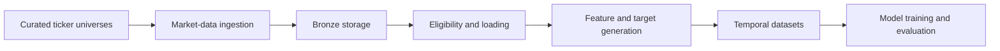
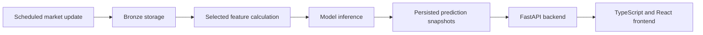

# Architecture Overview

Swingtrader is a data-first decision-support application. External market data must be reproducible and model inputs must be point-in-time safe before modeling, ranking, or user-interface code depends on them.

## Research Flow

The implemented repository currently supports the data and feature portions of this flow:



Feature and target generation currently runs in memory. Persistence of model-ready datasets remains optional and should be introduced only when reproducibility or operational evidence justifies it.

## Planned Production Flow

Production ranking should run as a scheduled workflow rather than inside an HTTP request:



The backend may serve bounded chart-data or indicator requests on demand, but it should not execute full-universe feature generation or model inference while a user waits for an API response.

## Implemented

- Curated universe YAML files and active ticker resolution.
- yfinance daily price download and normalization.
- Historical ingestion into `bronze_market_daily_prices` with idempotent upserts.
- Runnable onboarding and daily market-data update jobs.
- Bronze-backed inference-readiness and training-eligibility checks.
- Pandas loading from bronze daily prices.
- Reusable technical indicators.
- In-memory return, trend, momentum, volatility, price-action, volume, and market-structure feature generation.
- In-memory V1 forward-return and binary-target generation.
- Local SQLite and configurable SQLAlchemy database URLs.
- Automated Ruff, pytest, and strict MkDocs checks.

## Planned

- Consistent corporate-action semantics across cross-session indicators and features.
- Versioned feature-set definitions and model experiment manifests.
- Leakage-safe temporal train, validation, and test dataset construction.
- Baseline model training, evaluation, and feature selection.
- Local and scheduled production inference with prediction persistence.
- A FastAPI backend under `swingtrader.api`.
- A separate TypeScript and React application under `frontend/`.
- Render deployment and scheduled jobs.
- PostgreSQL production storage.
- Macro-data ingestion and macro/context features after the OHLCV-only V1 path is useful.

## Package Boundaries

The intended dependency direction is:

```text
jobs -> ingestion -> clients
jobs -> bronze
jobs -> feature and inference services

ingestion -> bronze
eligibility -> bronze
features -> indicators and shared numerical contracts
modeling -> data outputs and feature specifications
api -> application services and persisted outputs
frontend -> HTTP API only
```

The data layer must not import API or frontend implementation code. The API must not own numerical feature algorithms or model training. The React frontend must not access the database or depend on Python internals.

The current canonical pandas market frame remains an internal numerical-layer contract. Database, API, and frontend boundaries should use ordinary records or explicit schemas rather than exposing pandas index conventions.

See [Architecture Decisions](decisions/index.md) for accepted decisions and their rationale.
