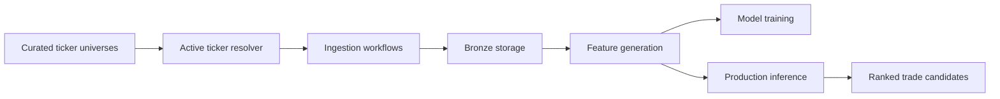

# Architecture Overview

Swingtrader is organized as a data-first application. The system should make external market data reproducible before any modeling or user interface logic depends on it.



## Implemented

- Curated universe YAML files.
- Active ticker resolution.
- yfinance historical daily price client.
- Historical ingestion into `bronze_market_daily_prices`.
- Idempotent bronze upserts.
- Bronze onboarding sync and runnable onboarding job for newly active tickers.
- Runnable daily market data update job for already-onboarded active tickers.
- Bronze-backed inference-readiness and training-eligibility checks.
- Pandas loading from bronze daily prices for notebook inspection and EDA.
- Generic database engine utilities in `core.db` and ready-to-use data-schema initialization in `data.db`.

## Planned

- Feature generation, with persistence still an open design decision.
- Train, validation, and test dataset construction.
- Model target, evaluation, and ranking output.
- Production inference and prediction persistence.
- Render deployment and scheduled jobs.
- Web dashboard for ranked candidates and risk-support workflows.
- Macro-data ingestion and macro/context features.

## Dependency Direction

The intended dependency direction is:

```text
jobs -> ingestion -> clients
jobs -> bronze
jobs -> data.db -> core.db
jobs -> features -> bronze
ingestion -> bronze
eligibility -> bronze
modeling -> data outputs
web -> data/modeling outputs
```

The data layer should not import implementation code from modeling or web. Generic database engine creation belongs in `core.db`; data-specific schema initialization belongs in `data.db`.