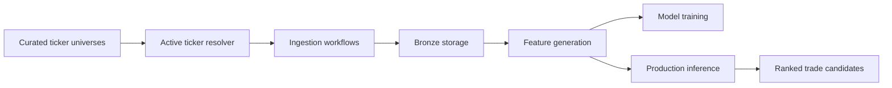

# Architecture Overview

Swingtrader is organized as a data-first application. The system should make external market data reproducible before any modeling or user interface logic depends on it.



## Implemented

- Curated universe YAML files.
- Active ticker resolution.
- yfinance historical daily price client.
- Historical ingestion into `bronze_market_daily_prices`.
- Idempotent bronze upserts.
- Bronze onboarding checks for newly active tickers.

## Planned

- Daily market data update job.
- Feature tables and feature generation.
- Inference readiness and training eligibility rules.
- Train, validation, and test dataset construction.
- Model target, evaluation, and ranking output.
- Render deployment and scheduled jobs.
- Web dashboard for ranked candidates and risk-support workflows.

## Dependency Direction

The intended dependency direction is:

```text
jobs -> ingestion -> clients
jobs -> bronze
jobs -> features -> bronze
modeling -> data outputs
web -> data/modeling outputs
```

The data layer should not import implementation code from modeling or web.