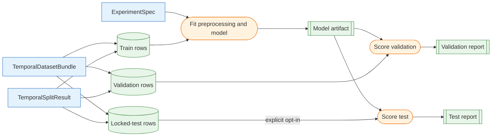

# Baseline Models and Evaluation Harness

The baseline harness establishes the minimum performance and reporting contract that later learned models must beat. It fits on the purged training rows, scores validation by default, and produces the same prediction and evaluation artifacts for every supported baseline.

The implementation is intentionally narrower than a general model framework. It supports the three baselines required for the first comparison cycle and leaves XGBoost, automatic feature selection, strategy simulation, and portfolio accounting downstream.

## Supported Baselines

| Model type | Purpose | Fitted state |
| --- | --- | --- |
| `CONSTANT_PRIOR_MODEL_TYPE` | Assign the training positive-class prevalence to every sample. | Training prevalence and row count; explicit schema when declared. |
| `RANDOM_RANKING_MODEL_TYPE` | Produce deterministic pseudo-random scores that are ranked separately within each date. | Random seed and row count; explicit schema when declared. |
| `LOGISTIC_REGRESSION_MODEL_TYPE` | Provide a simple learned linear benchmark. | Train-fitted ordered preprocessing schema, scaling, coefficients, and solver diagnostics. |

`ModelSpec.model_type` is the implementation identity stored in the experiment manifest. Use the exported constants instead of duplicating their string values:

```python
from swingtrader.modeling.experiments import ModelSpec
from swingtrader.modeling.training import LOGISTIC_REGRESSION_MODEL_TYPE

model_spec = ModelSpec(
    name="regularized_logistic_regression",
    version="1",
    model_type=LOGISTIC_REGRESSION_MODEL_TYPE,
    feature_columns=None,
    hyperparameters={
        "regularization_strength": 1.0,
        "max_iter": 1_000,
        "tolerance": 1e-8,
    },
)
```

The baseline uses scikit-learn `LogisticRegression` with the `lbfgs` solver and L2 regularization. The project-level `regularization_strength` retains the existing averaged-loss definition, `mean_log_loss + 0.5 * regularization_strength * ||coefficient||²`. Because scikit-learn scales `C` against the number of training rows, the adapter uses `C = 1 / (regularization_strength * training_rows)`. Larger project-level values therefore still produce stronger regularization without changing meaning when the training sample size changes. Numeric features are median-imputed, then mean-centered and standardized with population standard deviations fitted on training rows only. Infinite values are treated as missing, all-missing columns are retained and imputed with zero, and zero-variance columns receive a scale of one. The fitted preprocessing statistics, coefficients, solver settings, regularization mapping, and scikit-learn version are retained in `model.json`.

## Model-Level Feature Selection

`ModelSpec.feature_columns=None` preserves the existing all-feature behavior. An explicit tuple selects the exact ordered estimator schema without changing feature generation, is retained by every fitted baseline, and is reused during prediction. Extra candidate columns remain available to the existing evaluation reports.

For validation rules, train-only expanding folds, and a manual candidate workflow, see [Model Feature Selection and Train-Only Cross-Validation](feature-selection-and-cross-validation.md).

## Leakage Boundary

`run_baseline_experiment()` owns the train-dependent workflow:



The harness converts the canonical bundle with `to_tabular_dataset()`, indexes the original aligned frames with the splitter's positional indices, fits only on train, and applies the frozen model to each evaluated split. Validation is always evaluated. The locked test is read only when `include_locked_test=True`.

## Standard Prediction Frame

Every evaluated model is converted to one ordered row-level schema:

| Column | Meaning |
| --- | --- |
| `split` | Evaluated split name. |
| `target` | Complete binary supervised target. |
| `score` | Finite positive-class score in `[0, 1]`. |
| `predicted_class` | `score >= classification_threshold`. |
| `ranking_return` | Optional finite research outcome copied from the configured target column for ranking diagnostics. |

The frame preserves the canonical sorted sample index. The classification threshold is an evaluation choice; it is separate from the economic threshold or barrier rules used to construct the target. The report manifest also records the original `ranking_return_column` so a detached artifact still identifies the continuous outcome it evaluated.

## Run a Baseline Experiment

Assuming `bundle`, `split_result`, and `experiment_spec` have already been constructed:

```python
from swingtrader.modeling.experiments import start_experiment_run
from swingtrader.modeling.training import EvaluationConfig, run_baseline_experiment

config = EvaluationConfig(
    classification_threshold=0.5,
    calibration_bins=10,
    score_quantiles=10,
    top_k=5,
    random_seed=23,
)

with start_experiment_run(
    experiment_spec,
    experiment_name="swingtrader-baselines",
    dataset_summary=dataset_summary,
) as run:
    result = run_baseline_experiment(
        bundle,
        split_result,
        experiment_spec,
        ranking_return_column="forward_return_5d",
        evaluation_config=config,
        run=run,
    )

validation = result.reports["validation"]
print(validation.aggregate_metrics)
```

`start_experiment_run()` records the experiment manifest, specification digests, model hyperparameters, seeds, dataset summary, and Git revision. The baseline harness requires `EvaluationConfig.random_seed` to match the experiment's declared evaluation seed, then adds finite aggregate metrics and generated model, prediction, table, plot, and Markdown artifacts.

For a local run without MLflow, pass `artifact_directory=`. The artifact layout is:

```text
model.json
validation/
├── summary.json
├── predictions.csv.gz
├── per_date_metrics.csv
├── calibration.csv
├── score_quantiles.csv
├── score_quantiles_by_date.csv
├── top_k_by_date.csv
├── random_top_k_by_date.csv
├── feature_missingness.csv
├── report.md
└── plots/
    ├── calibration.svg
    ├── score_quantile_positive_rate.svg
    ├── score_quantile_return.svg
    └── top_k_return_distribution.svg
```

A parallel `test/` directory is produced only when the locked test is explicitly included.

## Interpreting Comparisons

The three baselines answer different questions:

- The constant prior establishes whether a learned probability model improves discrimination, log loss, or calibration beyond unconditional prevalence.
- The date-matched random ranker establishes whether top-ranked candidates beat selecting the same number of stocks from the same dates by chance.
- Regularized logistic regression establishes whether the feature set contains a stable linear signal before introducing nonlinear tree models.

Compare models only when the experiment, dataset, feature-set, target-set, universe, and split digests agree. Review pooled classification metrics together with calibration and per-date ranking behavior. A model with better pooled ROC AUC can still be unsuitable for the product if its top-ranked candidates do not improve positive rates or realized outcomes consistently across dates.

Score quantiles are assigned cross-sectionally within each date. Exact score ties are resolved with a deterministic pseudo-random secondary key derived from the evaluation seed and canonical sample identity, never by ticker or row order. `score_quantiles_by_date.csv` retains those daily results, while `score_quantiles.csv` gives equal weight to each represented date. The top-`k` model and random tables always use the same candidate count on each date. Return lift is calculated only across dates where both selections have an observed continuous outcome.

The continuous `ranking_return` remains a research diagnostic. It does not apply next-session entry assumptions and excludes transaction costs, spreads, slippage, stop-loss or take-profit execution, position sizing, and portfolio constraints. Treat it as evidence about ranking quality, not executable strategy P&L.

## Locked-Test Use

Routine development should leave `include_locked_test=False`. Select preprocessing, model family, hyperparameters, classification threshold, and ranking rule from train and validation only. After those choices are frozen, run the same harness once with `include_locked_test=True`. Any decision changed after inspecting the test result defines a new experiment and requires a new locked period for an unbiased final estimate.
