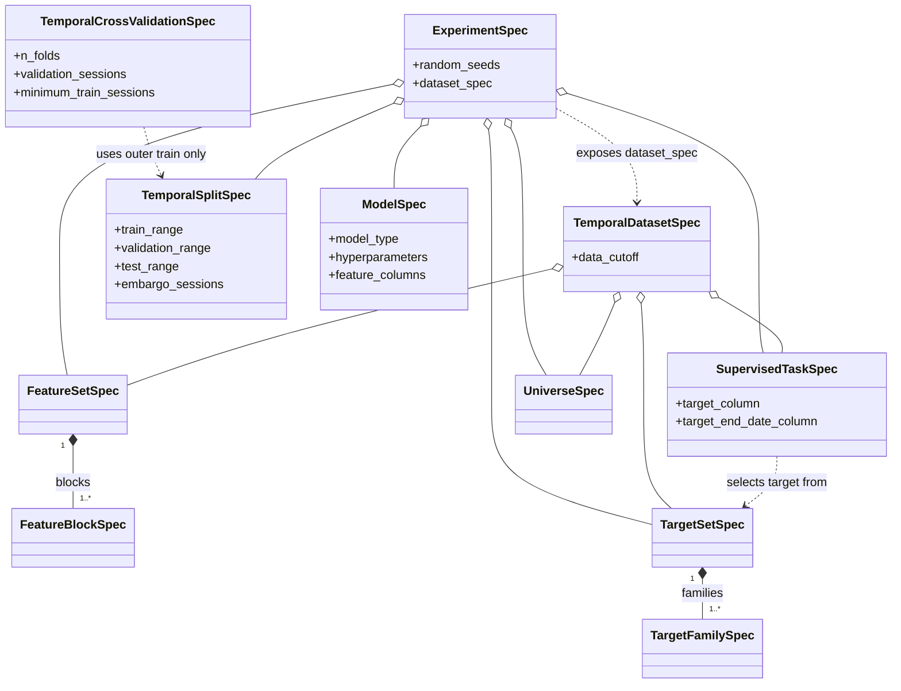

# Experiment Specifications and MLflow Tracking

Model experiments have two separate sources of provenance:

1. repository-owned specifications define what an experiment means;
2. MLflow records one execution of that specification and its results.

MLflow is therefore an execution ledger, not the source of experiment semantics. A run remains understandable from the serialized `ExperimentSpec` even before a dataset is built or a model is fitted.

## Install the Modeling Extra

The modeling extra installs scikit-learn for baseline fitting and `mlflow-skinny` together with the SQL storage dependencies needed for optional local SQLite tracking. It deliberately avoids the full MLflow distribution, whose additional model-flavor dependencies are unnecessary for this adapter. Data ingestion, feature generation, and target generation remain independent of the extra, while local baseline artifacts require scikit-learn but not MLflow.

```powershell
uv sync --extra modeling --dev
```

The tracking helpers import MLflow only when `start_experiment_run()` is called. Baseline fitting and evaluation use scikit-learn from the modeling extra but do not import MLflow.

## Experiment Contracts

The experiment package exposes five top-level immutable contracts:

| Contract | Purpose |
| --- | --- |
| `UniverseSpec` | Records provider and concrete ticker membership; it is owned by the lower-level dataset package and re-exported here. |
| `TemporalSplitSpec` | Declares shared, inclusive train, validation, and test calendar ranges plus an optional pre-boundary embargo. |
| `TemporalCrossValidationSpec` | Configures expanding global-date folds restricted to the existing outer train split. |
| `ModelSpec` | Records the model implementation identity, JSON-compatible hyperparameters, and optional exact ordered feature schema. |
| `ExperimentSpec` | Composes the feature set, target set, selected task, universe, data cutoff, split, model, and random seeds. |

The top-level and lower-level contracts compose as follows. Colors group feature, target, dataset, and experiment concerns; only fields that define important boundaries are shown.

For the canonical specification and runtime-artifact reference, see [Modeling Object Model](../reference/modeling-object-model.md).



The versioned identity specifications expose deterministic manifests and SHA-256 digests. `TemporalCrossValidationSpec` exposes deterministic manifest data but is supplied separately to the diagnostic cross-validation run and is not part of `ExperimentSpec.digest`. Ticker ordering does not affect a universe digest because membership order is not meaningful. Changes such as adding a ticker, changing a split date or embargo, selecting another target, changing a hyperparameter, or changing a seed do affect the experiment digest; changing only the cross-validation settings does not.

The Git revision is intentionally not part of the static `ExperimentSpec`. It describes the code used for a particular execution and is logged by the MLflow adapter when Git metadata is available.

## Define an Experiment Before Fitting

The following example uses the current candidate feature set, V2 ATR barrier task, and repository-owned regularized-logistic baseline. The ticker tuple is illustrative; production experiment definitions should use the actual resolved training universe.

```python
from datetime import date

from swingtrader.data.features.catalog import DEFAULT_FEATURE_SET
from swingtrader.modeling.datasets.catalog import V2_PRIMARY_TASK, V2_TARGET_SET
from swingtrader.modeling.experiments import (
    ExperimentSpec,
    ModelSpec,
    TemporalSplitSpec,
    UniverseSpec,
)
from swingtrader.modeling.training import LOGISTIC_REGRESSION_MODEL_TYPE

experiment_spec = ExperimentSpec(
    name="logistic_atr_barrier_baseline",
    version="1",
    feature_set=DEFAULT_FEATURE_SET,
    target_set=V2_TARGET_SET,
    task=V2_PRIMARY_TASK,
    universe=UniverseSpec(
        name="se_large_mid_cap_training",
        version="2026-07-24",
        provider="yfinance",
        tickers=("ABB.ST", "SAAB-B.ST", "VOLV-B.ST"),
    ),
    data_cutoff=date(2025, 12, 31),
    split=TemporalSplitSpec(
        name="initial_holdout",
        version="1",
        train_start=date(2010, 1, 1),
        train_end=date(2021, 12, 31),
        validation_start=date(2022, 1, 1),
        validation_end=date(2023, 12, 31),
        test_start=date(2024, 1, 1),
        test_end=date(2025, 12, 31),
        embargo_sessions=0,
    ),
    model=ModelSpec(
        name="regularized_logistic_regression",
        version="1",
        model_type=LOGISTIC_REGRESSION_MODEL_TYPE,
        feature_columns=None,
        hyperparameters={
            "regularization_strength": 1.0,
            "max_iter": 1_000,
            "tolerance": 1e-8,
        },
    ),
    random_seeds={"model": 17, "evaluation": 23},
)

print(experiment_spec.identifier)
print(experiment_spec.digest)
print(experiment_spec.to_json())
```

Build the canonical unsplit dataset from the lower-level part of the experiment specification, then apply the experiment's fixed split policy:

```python
from swingtrader.modeling.datasets import build_temporal_dataset
from swingtrader.modeling.experiments import FixedTemporalSplitter

bundle = build_temporal_dataset(
    engine=engine,
    spec=experiment_spec.dataset_spec,
)
split_result = FixedTemporalSplitter(experiment_spec.split).assign(bundle)
train_index = split_result.indices("train")
validation_index = split_result.indices("validation")
```

The dataset builder computes each row's actual `target_end_date` and aligned sample metadata. The splitter applies the same inclusive calendar ranges to every ticker, then purges a candidate row when its target ends after that split's end. Optional embargo removes additional global observed signal dates from the end of train and validation. Locked-test indices remain available through `split_result.indices("test")`, but routine model development should not read them. See [Temporal Splitting](temporal-splitting.md) for the complete boundary semantics and diagnostics.

## Run the Baseline Harness with MLflow

By default, run metadata is stored in the local SQLite database `./mlflow.db`, while MLflow stores generated artifacts under `./mlruns`. Set `MLFLOW_TRACKING_URI` or pass `tracking_uri=` to use another local database or a future tracking service.

The split summary below is illustrative. Use the observed split summary from the dataset execution being logged.

```python
from datetime import date

from swingtrader.modeling.experiments import (
    DatasetSplitSummary,
    DatasetSummary,
    start_experiment_run,
)
from swingtrader.modeling.training import EvaluationConfig, run_baseline_experiment

summary = DatasetSummary(
    train=DatasetSplitSummary(
        rows=120_000,
        ticker_count=3,
        start_date=date(2010, 1, 4),
        end_date=date(2021, 12, 30),
        class_prevalence=0.18,
    ),
    validation=DatasetSplitSummary(
        rows=24_000,
        ticker_count=3,
        start_date=date(2022, 1, 3),
        end_date=date(2023, 12, 29),
        class_prevalence=0.17,
    ),
    test=DatasetSplitSummary(
        rows=25_000,
        ticker_count=3,
        start_date=date(2024, 1, 2),
        end_date=date(2025, 12, 30),
        class_prevalence=0.16,
    ),
)

config = EvaluationConfig(
    classification_threshold=0.5,
    calibration_bins=10,
    score_quantiles=10,
    top_k=5,
    random_seed=23,
)

with start_experiment_run(
    experiment_spec,
    experiment_name="swingtrader-baselines",
    dataset_summary=summary,
) as run:
    result = run_baseline_experiment(
        bundle,
        split_result,
        experiment_spec,
        ranking_return_column="forward_return_5d",
        evaluation_config=config,
        run=run,
    )
```

The initialized run records:

- experiment, feature-set, target-set, universe, split, and model identities and digests;
- selected task and target column;
- data cutoff, hyperparameters, random seeds, and Git commit when available;
- split row counts, ticker counts, date ranges, and optional class prevalence;
- the complete canonical experiment manifest at `manifests/experiment.json`;
- finite validation metrics and the fitted-model manifest;
- row-level predictions, per-date metrics, calibration and ranking tables, Markdown summaries, and SVG plots.

`run_baseline_experiment()` evaluates validation by default. A supplied `EvaluationConfig.random_seed` must equal the experiment's declared evaluation seed so the experiment digest cannot describe different random comparisons or score-tie resolutions. Pass `include_locked_test=True` only after the preprocessing, model, hyperparameter, threshold, and ranking choices are frozen. For a local run without MLflow, pass `artifact_directory=` instead; see [Baseline Models and Evaluation Harness](baseline-models.md).

Dataset summaries deliberately contain no feature or target rows. Before a run starts, their ticker counts and observed date ranges are checked against the experiment's declared universe and temporal split. The current Yahoo Finance bronze data remains the historical source of truth, while stronger source-data versioning or materialized dataset snapshots can be added later if the data source becomes mutable or multi-provider.

The lightweight project dependency intentionally does not install MLflow's server or UI. To inspect recorded runs, launch a transient full MLflow CLI against the same database:

```powershell
uvx --from mlflow==3.14.0 mlflow server --backend-store-uri sqlite:///mlflow.db --port 5000
```

Open `http://127.0.0.1:5000` to inspect experiments and compare runs. The server is optional for logging; project code writes directly to SQLite through the lightweight client.

## Compare Runs

Compare runs with both configuration and outcome in view:

1. confirm the experiment, feature-set, target-set, universe, and split digests;
2. compare model hyperparameters, preprocessing manifests, evaluation settings, and random seeds;
3. inspect row counts, date ranges, ticker counts, prevalence, and missingness for unexpected dataset drift;
4. compare discrimination, calibration, daily cross-sectional ranking, and date-matched random results;
5. inspect generated reports and plots before promoting conclusions.

A metric difference is not attributable to the model when the underlying experiment digests or dataset summaries also changed.

## Current Boundary

Implemented here:

- immutable experiment specifications;
- canonical unsplit temporal dataset specifications and construction;
- purged fixed train/validation/locked-test assignment with optional embargo and diagnostics;
- explicit ordered model-level feature schemas;
- expanding global-date cross-validation restricted to outer train;
- deterministic manifests and identities;
- local MLflow run initialization;
- Git-revision, parameter, summary, metric, and artifact logging;
- three deterministic baseline models with train-only preprocessing;
- standardized prediction, classification, calibration, ranking, and dataset-context reports;
- validation-first local and MLflow artifact generation.

Still planned:

- XGBoost and later nonlinear candidates;
- automatic feature-selection, candidate-ranking, and winner-selection policies;
- remote tracking, registry promotion, production inference, and serving.
