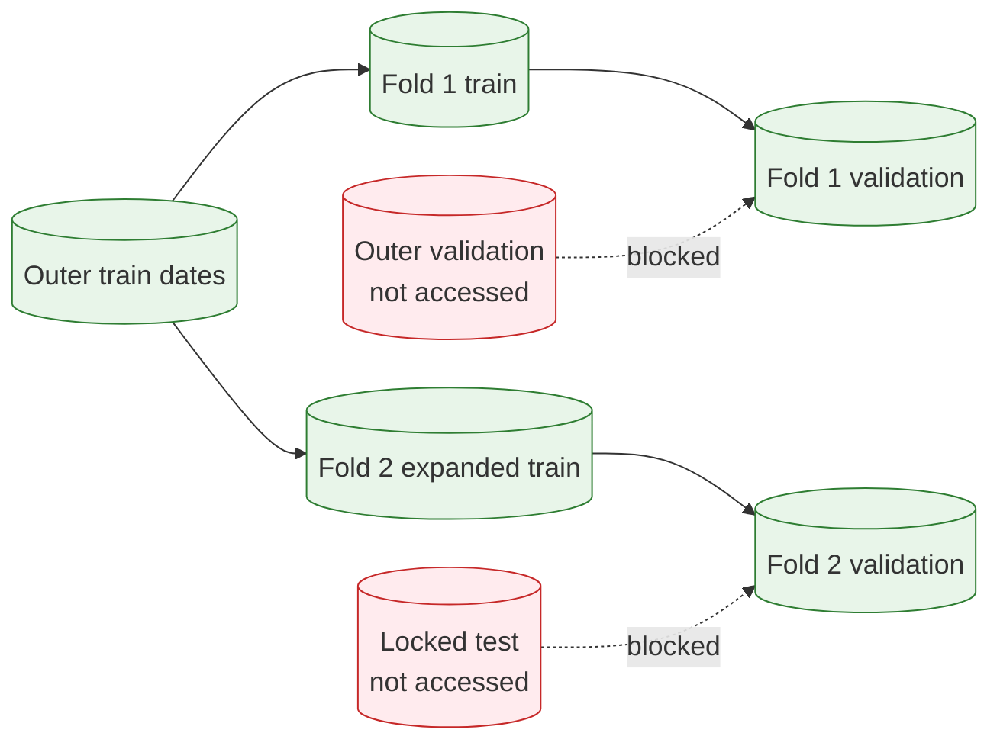

# Model Feature Selection and Train-Only Cross-Validation

Issue-specific model development now has two explicit, separate contracts:

1. the feature set declares which columns are generated in the canonical temporal dataset;
2. the model specification declares which of those generated columns the estimator consumes.

This separation keeps feature computation reproducible without treating `FeatureBlockSpec.output_columns` as a model-selection mechanism. Selecting fewer model inputs does not prune feature generation.

## Ordered Model Input Schemas

`ModelSpec.feature_columns` is either `None` or a non-empty tuple of unique feature names.

```python
from swingtrader.modeling.experiments import ModelSpec
from swingtrader.modeling.training import LOGISTIC_REGRESSION_MODEL_TYPE

all_features = ModelSpec(
    name="logistic_all_features",
    version="1",
    model_type=LOGISTIC_REGRESSION_MODEL_TYPE,
    feature_columns=None,
)

selected_features = ModelSpec(
    name="logistic_selected_features",
    version="1",
    model_type=LOGISTIC_REGRESSION_MODEL_TYPE,
    feature_columns=(
        "return_5d",
        "close_to_ema_fast",
        "rsi",
        "atr_percent",
        "turnover_zscore",
    ),
)
```

`None` preserves the complete canonical order from `TemporalDatasetBundle.features`. An explicit tuple is the exact estimator order, even when it differs from the generated order. Empty, duplicate, non-string, and unknown columns are rejected. Explicit schemas are retained by every fitted baseline and applied during prediction; additional candidate columns are ignored. In all-feature mode, logistic regression retains its fitted preprocessing order, while the constant and random baselines preserve their previous all-column behavior.

The public resolver can be used before fitting to inspect the effective schema:

```python
from swingtrader.modeling.experiments import resolve_model_feature_columns

resolved = resolve_model_feature_columns(
    selected_features,
    bundle.manifest.feature_columns,
)
```

## Expanding Folds Inside Outer Train

Inner cross-validation is a diagnostic for manually chosen logistic-regression candidates. It never reads the outer validation or locked-test positions.



`TemporalCrossValidationSpec` defines a fold count, a fixed number of consecutive validation sessions per fold, and the minimum number of retained training sessions:

```python
from swingtrader.modeling.experiments import TemporalCrossValidationSpec
from swingtrader.modeling.training import run_baseline_cross_validation

cv_spec = TemporalCrossValidationSpec(
    n_folds=4,
    validation_sessions=63,
    minimum_train_sessions=504,
)

cv_results = run_baseline_cross_validation(
    bundle,
    split_result,
    experiment_spec,
    cv_spec,
)
```

The fold builder uses global observed trading dates from the existing outer train split. Every ticker row for one candidate date enters the same train or validation partition. Training expands from fold to fold, while validation blocks are consecutive and non-overlapping. Each partition then applies the same per-row containment rule as the outer split: `target_end_date` must not exceed that partition's inclusive end. No calendar-day approximation of the target horizon is introduced.

Each fold fits a fresh median imputer, standardizer, and logistic estimator on only that fold's training rows. The returned `DataFrame` is intentionally compact:

- fold number and train/validation date boundaries;
- retained train and validation row counts;
- train and validation precision;
- train and validation recall;
- train and validation ROC AUC.

Comparing train and validation columns exposes simple overfitting signals without creating a generalized reporting or candidate-ranking subsystem.

## Manual Candidate Workflow

Candidate choice remains explicit. Define a small number of scientifically motivated schemas, run the same train-only folds for each, inspect the compact results, and then manually choose one specification. The chosen specification can be passed to the existing outer harness without changing its evaluation outputs:

```python
from dataclasses import replace

from swingtrader.modeling.training import run_baseline_experiment

chosen_experiment = replace(experiment_spec, model=selected_features)
outer_result = run_baseline_experiment(
    bundle,
    split_result,
    chosen_experiment,
    include_locked_test=False,
)
```

Outer validation remains the development holdout for the selected configuration. The locked test stays disabled until the feature schema, preprocessing, model configuration, threshold, and ranking rule are frozen.
