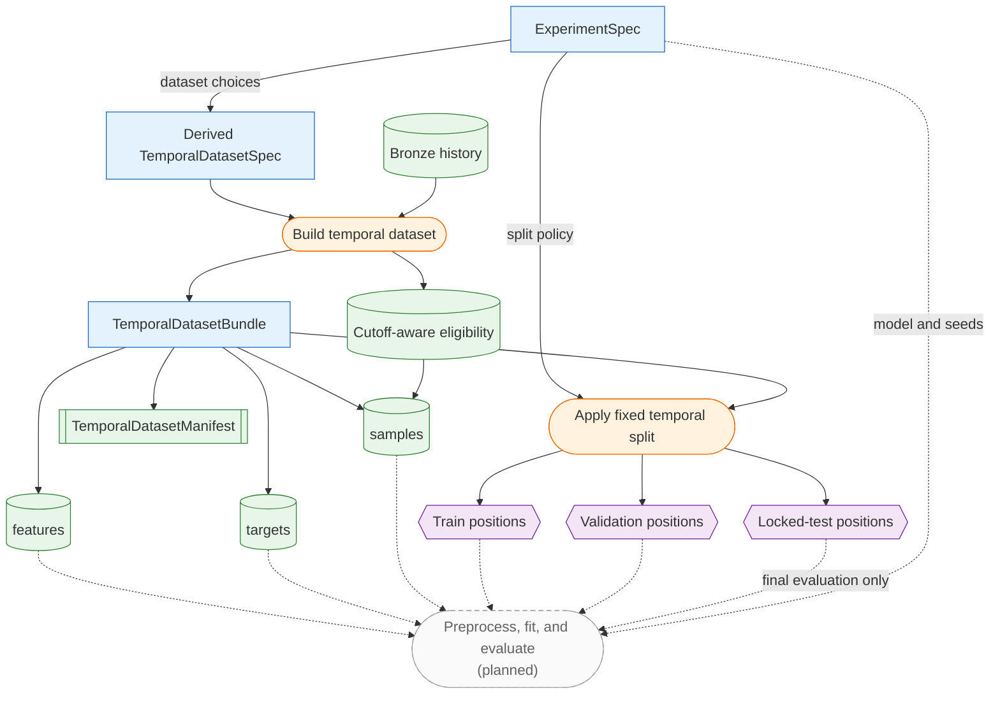

# Modeling Overview

The modeling layer turns point-in-time-safe market history into reproducible supervised-learning datasets, assigns leakage-safe temporal splits, and will later train and evaluate ranking models. The individual contracts and operations are described on focused pages; this page provides the end-to-end red line.

The implemented target contracts are grouped under [Targets](targets/index.md), dataset construction is documented in [Temporal Datasets](temporal-datasets.md), split semantics in [Temporal Splitting](temporal-splitting.md), and experiment provenance in [Experiment Specifications and MLflow Tracking](experiments.md). [Modeling Workflows](workflows.md) describes how these components are composed, while the [Modeling Object Model](../reference/modeling-object-model.md) is the canonical reference for relationships between specifications and runtime artifacts.

Rectangles are specifications or runtime containers, rounded boxes are operations, cylinders are tabular data, double-bordered boxes are manifests, and hexagons are split assignments. Dashed edges lead to planned work.

## Implemented Components

Feature and target builders consume the same canonical market-price DataFrame: a unique, sorted `MultiIndex` with levels `provider`, `ticker`, and `trading_date`, with identifiers absent from ordinary columns. V1 calculates forward returns and a fixed-return classification target. V2 preserves those outputs and adds next-open ATR-scaled barrier events, target resolution dates, and measurable same-bar ambiguity.

`TemporalDatasetSpec` defines only the unsplit data product. Features and targets are calculated independently over the same full historical prefix, then aligned with sample metadata and a deterministic manifest. Feature NaNs are retained; rows are excluded only when the selected target is unavailable.

The experiment package applies split policy downstream, using each row's actual target resolution date for purging and an optional global pre-boundary embargo. `ExperimentSpec.dataset_spec` keeps dataset construction independent of model, seed, and MLflow concerns, while the optional MLflow adapter records executions and runtime provenance.

Feature and target persistence, materialized dataset snapshots, expanding-window folds, model training, and standardized evaluation reports remain planned.

## Inference Readiness

Inference readiness currently evaluates bronze daily-price state only. Production inference will later add model-ready feature availability, recency, and input-window requirements. The current bronze conditions are defined under [Ticker Eligibility — Version 1 Bronze Rules](../data/eligibility.md#version-1-bronze-rules).

## Training Eligibility

Training eligibility remains distinct from active-universe membership and inference readiness. The temporal dataset records cutoff-aware eligibility as sample metadata rather than silently filtering declared universe members. The splitter preserves this metadata without filtering it; training code can add minimum usable-sample rules appropriate to the selected task and split design. The current bronze conditions are defined under [Ticker Eligibility — Version 1 Bronze Rules](../data/eligibility.md#version-1-bronze-rules).

## Planned Components

- expanding-window walk-forward folds;
- baseline ranking models;
- standardized evaluation reports;
- local model registry;
- production inference workflow.
