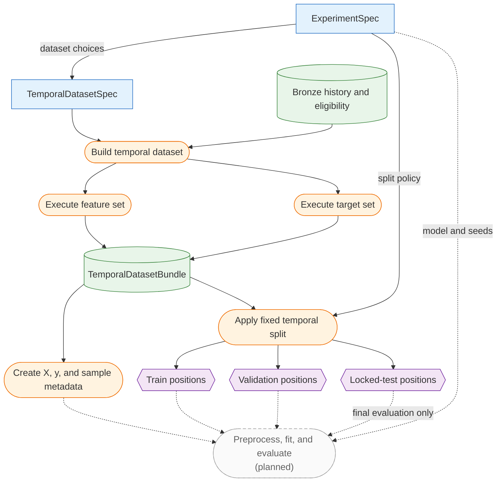

# Modeling Overview

Modeling code now includes reusable V1 and V2 target generation, explicit versioned target-set contracts, canonical unsplit temporal dataset construction, purged fixed temporal splitting, immutable experiment specifications, and optional local MLflow tracking.

The V1 research-return contract is documented in [Target and Evaluation](target-and-evaluation.md), V2 execution-oriented labels in [ATR Barrier Targets](atr-barrier-targets.md), dataset construction in [Temporal Datasets](temporal-datasets.md), split semantics in [Temporal Splitting](temporal-splitting.md), and experiment provenance in [Experiment Specifications and MLflow Tracking](experiments.md).

The implemented modeling path separates dataset construction from split policy and later model fitting:

Rectangles are immutable specifications, rounded boxes are operations, cylinders are data
products, and hexagons are split assignments. Dashed edges lead to planned work.

## Implemented Components

Feature and target builders consume the same canonical market-price DataFrame: a unique, sorted `MultiIndex` with levels `provider`, `ticker`, and `trading_date`, with identifiers absent from ordinary columns. V1 calculates forward returns and a fixed-return classification target. V2 preserves those outputs and adds next-open ATR-scaled barrier events, target resolution dates, and measurable same-bar ambiguity.

`TemporalDatasetSpec` defines only the unsplit data product. Features and targets are calculated independently over the same full historical prefix, then aligned with sample metadata and a deterministic manifest. Feature NaNs are retained; rows are excluded only when the selected target is unavailable.

The experiment package applies split policy downstream, using each row's actual target resolution date for purging and an optional global pre-boundary embargo. `ExperimentSpec.dataset_spec` keeps dataset construction independent of model, seed, and MLflow concerns, while the optional MLflow adapter records executions and runtime provenance.

Feature and target persistence, materialized dataset snapshots, expanding-window folds, model training, and standardized evaluation reports remain planned.

## Inference Readiness

Inference readiness currently evaluates bronze daily-price state only. Production inference will later add model-ready feature availability, recency, and input-window requirements.

## Training Eligibility

Training eligibility remains distinct from active-universe membership and inference readiness. The temporal dataset records cutoff-aware eligibility as sample metadata rather than silently filtering declared universe members. The splitter preserves this metadata without filtering it; training code can add minimum usable-sample rules appropriate to the selected task and split design.

## Planned Components

- expanding-window walk-forward folds;
- baseline ranking models;
- standardized evaluation reports;
- local model registry;
- production inference workflow.
