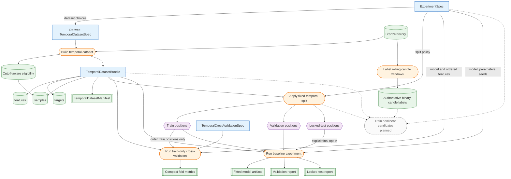

# Modeling Overview

The modeling layer turns point-in-time-safe market history into reproducible supervised-learning datasets, assigns leakage-safe temporal splits, trains and evaluates reference models through a standardized baseline harness, and provides a small executable daily-bar backtesting pilot. The individual contracts and operations are described on focused pages; this page provides the end-to-end red line.

The implemented target contracts are grouped under [Targets](targets/index.md), dataset construction is documented in [Temporal Datasets](temporal-datasets.md), split semantics in [Temporal Splitting](temporal-splitting.md), model-level input schemas and train-only diagnostics in [Model Feature Selection and Train-Only Cross-Validation](feature-selection-and-cross-validation.md), baseline fitting in [Baseline Models and Evaluation Harness](baseline-models.md), executable simulation in [Backtesting Pilot](backtesting.md), and experiment provenance in [Experiment Specifications and MLflow Tracking](experiments.md). [Modeling Workflows](workflows.md) describes how these components are composed, while the [Modeling Object Model](../reference/modeling-object-model.md) is the canonical reference for relationships between specifications and runtime artifacts.

Rectangles are specifications or runtime containers, rounded boxes are operations, cylinders are tabular data, double-bordered boxes are manifests or reports, and hexagons are split assignments. Dashed edges lead to planned work.

## Implemented Components

Feature and target builders consume the same canonical market-price DataFrame: a unique, sorted `MultiIndex` with levels `provider`, `ticker`, and `trading_date`, with identifiers absent from ordinary columns. V1 calculates forward returns and a fixed-return classification target. V3 preserves those outputs and adds a next-open ATR-scaled triple-barrier label, one time-to-event column, and target-resolution metadata for purging. V4 preserves both earlier schemas and adds market-relative forward returns, same-date future-return percentiles, and ordinal relevance grades.

`TemporalDatasetSpec` defines only the unsplit data product. Features and targets are calculated independently over the same full historical prefix, then aligned with sample metadata and a deterministic manifest. Feature NaNs are retained; rows are excluded only when the selected target is unavailable.

The experiment package applies split policy downstream, using each row's actual target resolution date for purging and an optional global pre-boundary embargo. `ModelSpec.feature_columns` separately defines an optional exact ordered estimator schema without changing feature-generation contracts. `ExperimentSpec.dataset_spec` keeps dataset construction independent of model, seed, and MLflow concerns, while the optional MLflow adapter records executions and runtime provenance.

The training package implements a constant-prior classifier, deterministic date-matched random ranker, regularized logistic regression with train-only median imputation and scaling, expanding global-date cross-validation confined to outer train, a canonical prediction frame, and reusable classification, calibration, cross-sectional ranking, artifact, and MLflow logging workflows. Each inner fold fits preprocessing and the estimator independently and reports compact train/validation diagnostics.

The entry-labeling workflow records one authoritative binary label per provider, ticker, and trading date. Deterministic planned windows remain independent of Plotly zoom and pan state, and the configured validation-end boundary prevents the workflow from displaying locked-test candles or outcomes.

The backtesting pilot is intentionally separate from research-target evaluation. It consumes raw OHLC execution prices and point-in-time score/ATR signals, applies next-open execution, ATR risk sizing, fixed stop/target rules, timeout exits, commissions, and a maximum-position constraint, then returns pandas transaction, equity, and summary tables.

Validation is the routine outer evaluation split; locked-test evaluation requires explicit opt-in.

Feature and target persistence, materialized dataset snapshots, nonlinear model candidates, model registration, and production inference remain planned.

## Inference Readiness

Inference readiness currently evaluates bronze daily-price state only. Production inference will later add model-ready feature availability, recency, and input-window requirements. The current bronze conditions are defined under [Ticker Eligibility — Version 1 Bronze Rules](../data/eligibility.md#version-1-bronze-rules).

## Training Eligibility

Training eligibility remains distinct from active-universe membership and inference readiness. The temporal dataset records cutoff-aware eligibility as sample metadata rather than silently filtering declared universe members. The splitter preserves this metadata without filtering it; training code can add minimum usable-sample rules appropriate to the selected task and split design. The current bronze conditions are defined under [Ticker Eligibility — Version 1 Bronze Rules](../data/eligibility.md#version-1-bronze-rules).

## Planned Components

- XGBoost classification and regression candidates;
- automated feature ablation, candidate ranking, and winner-selection policies;
- local model registry;
- production inference workflow.
