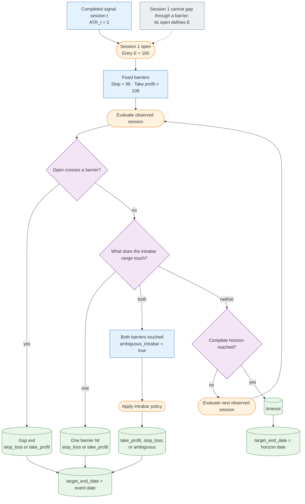

# V2 ATR Barrier Target

The versioned `ohlcv_price_targets:2` target set extends the V1 forward-return labels with ATR-scaled barrier-event outcomes. These targets answer an execution-oriented research question:

> If the completed bar on session `t` produced a signal and a hypothetical long
> position entered at the next observed session's open, would a fixed take-profit
> barrier be reached before a fixed stop-loss barrier within the selected horizon?

They are research labels, not a production order simulator or portfolio backtest.

| Property | Value |
| --- | --- |
| Target version | V2 (`ohlcv_price_targets:2`) |
| Learning task | Binary classification |
| Selected task output | One selected target value per sample; not multiclass or multilabel |
| Primary target | `target_tp_before_sl_5d` |
| Supporting outputs | Barrier event, event session, ambiguity flag, and target end date per horizon |
| Signal date | Completed daily bar on session `t` |
| Entry rule | Next observed session open |
| Resolution date | First barrier event or the configured timeout session |
| Positive class | Take-profit is reached before stop-loss |
| Intended use | Execution-oriented probability estimation and candidate ranking |
| Main limitation | Daily OHLC cannot identify intrabar ordering when both barriers are touched |

The V1 contract is documented in [V1 Significant Forward Return Target](v1-forward-return.md). Shared reporting guidance is documented in [Model Evaluation](../evaluation.md).

## Default Contract

The V2 catalog uses:

| Parameter | Default |
| --- | ---: |
| ATR length | 14 sessions |
| Entry rule | next observed session open |
| Stop distance | `2.0 * ATR_t` |
| Reward/risk ratio | `2.0` |
| Horizons | 5, 10, and 15 observed sessions |
| Same-bar policy | `exclude_ambiguous` |

For entry price `E`, signal-row ATR `A`, stop multiple `k`, and reward/risk ratio
`R`:

```text
stop_price = E - k * A
take_profit_price = E + R * k * A
```

Before ATR and barrier evaluation, raw OHLC values are expressed on the
adjusted-close scale using the row-wise factor `adjusted_close / close`. This
keeps the model-facing path economically continuous across splits and dividend
adjustments while preserving same-session candle geometry.

ATR is calculated only from data available through the completed signal bar
`t`. The entry and all barrier observations are future information used only to
construct labels.

## Session Semantics

Horizons count observed sessions within each provider/ticker series, not calendar
days. Session 1 is the next observed row after the signal row and supplies the
entry open. A 5-session label therefore evaluates sessions `t+1` through `t+5`.

Input must use the canonical, unique, sorted `MultiIndex` with levels `provider`,
`ticker`, and `trading_date`, in that exact order. The identifiers must not also
appear as ordinary columns. Target generation preserves this index. Value columns
must include raw `open`, `high`, `low`, and `close` plus `adjusted_close`.

A row remains unlabeled when:

- the available future sessions end before either barrier is reached and before
  the complete timeout horizon;
- the signal-row ATR is missing, non-finite, or non-positive;
- a required OHLC observation is invalid before the event is resolved; or
- the configured stop would be non-positive.

A TP, SL, or ambiguous event observed before the data ends remains labelable even
when the full timeout horizon is unavailable. Unresolved terminal paths are never
coerced into the negative class.

## Worked Example

Assume the completed signal bar has `ATR_t = 2`, the next observed open is
`E = 100`, `k = 2`, and `R = 2`. The fixed barriers are therefore:

```text
stop_price = 100 - 2 * 2 = 96
take_profit_price = 100 + 2 * 2 * 2 = 108
```

The event lifecycle fixes the barriers once, then evaluates each future observed
session until a barrier event or the complete timeout horizon resolves the label.
Rectangles are fixed states, rounded boxes are evaluations, diamonds are decisions,
and cylinders are emitted outcomes:



For example, session 1 can trade between 98 and 104 without resolving the event.
If session 2 opens at 95, the opening gap produces `stop_loss` with
`event_session = 2`, even if the price later trades above 108. If it opens at 100
and trades from 95 to 109, both barriers are touched and the configured intrabar
policy resolves the event while `ambiguous_intrabar` remains true.

## Gap Handling

Each evaluated session checks the open before its intrabar high and low:

1. `open <= stop_price` produces `stop_loss` at the open;
2. `open >= take_profit_price` produces `take_profit` at the open;
3. otherwise, the session high and low are evaluated.

This ordering makes gaps deterministic. The entry session itself cannot gap
through a barrier because its open defines `E`; gap exits can occur from the
second evaluated session onward.

## Same-Bar Ambiguity

Daily OHLC data does not reveal whether the high or low occurred first. When one
bar touches both barriers, `ambiguous_intrabar_{horizon}d` is `true` regardless
of how the configured policy resolves the event.

Supported policies are:

| Policy | Resolution |
| --- | --- |
| `stop_first` | classify the event as `stop_loss` |
| `target_first` | classify the event as `take_profit` |
| `exclude_ambiguous` | emit `ambiguous`; leave the binary target missing |
| `candle_path` | green: open-low-high-close; red: open-high-low-close |

For `candle_path`, a doji (`close == open`) is resolved conservatively as
`stop_loss`. The heuristic is deterministic but remains an approximation; the
ambiguity flag allows prevalence and sensitivity to be reported explicitly.

## Output Columns

For each configured horizon `h`, the family adds:

| Column | Meaning |
| --- | --- |
| `barrier_event_{h}d` | `take_profit`, `stop_loss`, `timeout`, or `ambiguous` |
| `target_tp_before_sl_{h}d` | nullable Boolean; true only when TP wins |
| `event_session_{h}d` | 1-based session of TP, SL, or ambiguous resolution |
| `time_to_event_{h}d` | event session, or the full horizon for a timeout |
| `ambiguous_intrabar_{h}d` | nullable Boolean ambiguity indicator |
| `target_end_date_{h}d` | event-resolution date, or horizon date for timeout |

`event_session_{h}d` is missing for timeouts because no barrier event occurred.
`target_tp_before_sl_{h}d` is false for both stop losses and timeouts, missing for
excluded ambiguous bars, and missing for all otherwise unlabeled rows.

The V2 primary supervised task selects `target_tp_before_sl_5d` and declares `target_end_date_5d` as its resolution-date output. Canonical temporal dataset construction copies that actual event or timeout date into aligned sample metadata for later purging.

MFE and MAE are intentionally not emitted in this first implementation. With
only daily OHLC, excursions after a gap exit or after the first intrabar barrier
cannot be ordered reliably without adding another path assumption.

## Using the Builder

```python
from swingtrader.modeling.datasets import add_atr_barrier_targets

prices = (
    prices
    .set_index(["provider", "ticker", "trading_date"])
    .sort_index()
)
labeled = add_atr_barrier_targets(
    prices,
    atr_length=14,
    stop_atr_multiple=2.0,
    reward_risk_ratio=2.0,
    horizons=(5, 10, 15),
    entry_price_rule="next_open",
    intrabar_policy="exclude_ambiguous",
)
```

To generate the complete versioned V2 label set, including the V1 forward-return
families:

```python
from swingtrader.modeling.datasets import generate_v2_labels

labeled = generate_v2_labels(prices)
```

All material parameters, required inputs, output columns, builder paths, and the
maximum future horizon are serialized in the V2 target-set manifest. Changing a
barrier parameter changes the manifest digest and should be accompanied by a new
target-set version when it changes the intended experiment contract.
