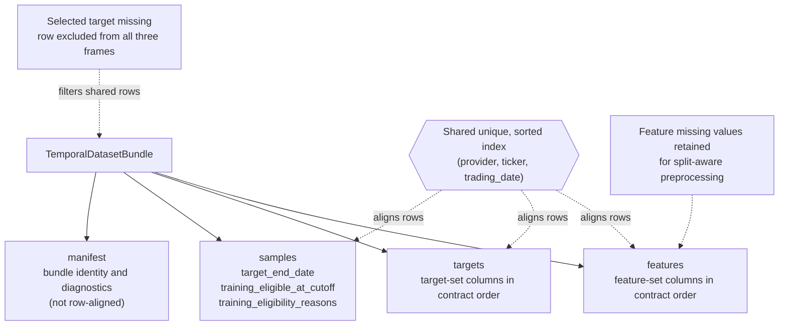

# Temporal Datasets

The temporal dataset layer creates the canonical unsplit modeling product between feature/target generation and downstream temporal splitting or model training.

## Dataset Specification

`TemporalDatasetSpec` contains only choices that determine the unsplit data:

- a versioned `FeatureSetSpec`;
- a versioned `TargetSetSpec`;
- one `SupervisedTaskSpec`;
- a resolved `UniverseSpec` with concrete provider and ticker membership;
- an inclusive `data_cutoff`.

Split dates, model hyperparameters, random seeds, and MLflow are intentionally absent. An `ExperimentSpec` exposes the same lower-level contract through `experiment_spec.dataset_spec`.

## Construction

```python
from swingtrader.modeling.datasets import build_temporal_dataset

bundle = build_temporal_dataset(
    engine=engine,
    spec=experiment_spec.dataset_spec,
)
```

The builder loads all required bronze source columns through the cutoff and computes every configured feature block over the complete legitimate historical prefix. Targets are computed independently from the same canonical price frame. This is required for expanding and path-dependent features whose values would change if history were truncated at a train-split boundary.

Use `construct_temporal_dataset()` when a caller already owns the canonical historical frame and cutoff-aware eligibility metadata.

## Bundle Contract

`TemporalDatasetBundle` owns three row-aligned frames and one bundle-level manifest:



The selected supervised target is complete in every retained row. Feature warm-up and source-quality gaps remain visible until split-aware preprocessing. Tickers that fail current training-eligibility gates remain in the declared universe and are marked in `samples`; a completely missing declared ticker is an error.

For fixed-horizon targets, `target_end_date` is derived from observed sessions within each provider/ticker history. Event targets can instead declare an explicit target output such as `target_end_date_5d`, preserving the actual event or timeout resolution date.

## Tabular Adapter

```python
from swingtrader.modeling.datasets import to_tabular_dataset

tabular = to_tabular_dataset(bundle)
X = tabular.X
y = tabular.y
samples = tabular.samples
```

The adapter performs no split, purging, imputation, scaling, sampling, or model-specific dtype conversion. Those operations must be fitted or applied inside the split-aware temporal training workflow.

## Current Boundary

Implemented:

- full-prefix feature and target computation;
- deterministic sample alignment and schema validation;
- selected-target filtering while preserving feature NaNs;
- task-specific target resolution dates;
- cutoff-aware training-eligibility metadata;
- manifest diagnostics and a framework-neutral tabular adapter.

Fixed train/validation/test assignment, actual-target-end purging, and optional embargo are implemented downstream in [Temporal Splitting](temporal-splitting.md).

Still planned:

- expanding-window folds;
- model-specific preprocessing and training;
- persisted or content-addressed dataset snapshots.
