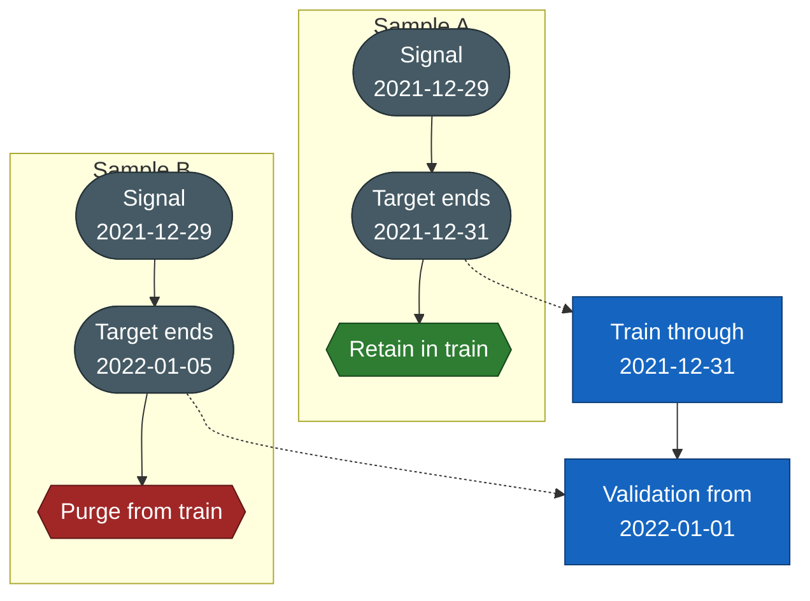
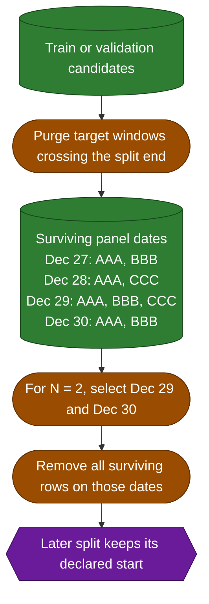

# Temporal Splitting

The experiment layer applies one fixed chronological train, validation, and locked-test policy to a canonical `TemporalDatasetBundle`. It does not recompute features or targets and does not mutate the unsplit bundle.

## Containment Rule

Each declared range is inclusive and shared by every ticker. Assignment has two stages:

1. the signal date must lie inside the range;
2. the row's actual `target_end_date` must be no later than that range's end.

The signal date determines the candidate split, while the complete target window determines whether the candidate is retained:

Signals and target end dates are states; the final hexagon is the assignment decision:



Both rows are training candidates by signal date. Sample A is retained because its target ends on the inclusive train boundary; Sample B is purged because its target window crosses that boundary. The same rule removes validation rows whose targets resolve after validation, including inside the locked test period.

Purging uses the per-row metadata produced by the canonical dataset. It never converts a session horizon into an assumed number of calendar days.

## Embargo Semantics

`embargo_sessions=0` disables embargo. A positive value applies an additional global pre-boundary gap after purging:

Rounded boxes are operations, the cylinder is the surviving panel, and the final hexagon is the
resulting boundary state:



The dates are selected once across the complete panel, not separately for each ticker. The embargo does not shift validation or test ranges and is not applied after the locked test period. Dates already emptied by purging do not count, so `N` always means `N` additional observed signal dates.

## Usage

```python
from swingtrader.modeling.experiments import FixedTemporalSplitter

splitter = FixedTemporalSplitter(experiment_spec.split)
split_result = splitter.assign(bundle)

train_index = split_result.indices("train")
validation_index = split_result.indices("validation")
locked_test_index = split_result.indices("test")

X_train = bundle.features.iloc[train_index]
y_train = bundle.targets.iloc[train_index]
```

For scikit-learn-style model selection, the splitter yields one train/validation pair and deliberately omits test:

```python
for train_index, validation_index in splitter.split(bundle):
    ...
```

Access the test indices only for final locked evaluation.

## Assignment Metadata

`split_result.samples` retains every canonical sample and adds:

- `split`: `train`, `validation`, or `test` for assigned rows;
- `split_exclusion_reason`: `outside_declared_ranges`, `target_end_after_split_end`, or `embargo` for excluded rows.

Exactly one of these columns is populated for each row. This preserves an auditable account of samples outside the selected periods and samples removed for leakage control.

## Diagnostics

The deterministic split manifest records:

- source, assigned, outside-range, purged, and embargoed row counts;
- candidate and assigned rows per split;
- unique signal dates and tickers per split;
- observed signal-date and target-end-date ranges;
- binary-class prevalence when the selected classification target is Boolean or encoded as 0/1;
- the dataset-manifest and split-specification digests.

Use coverage diagnostics when choosing split dates. Each post-purge split must retain enough dates, tickers, and positive labels for its intended role. The splitter validates semantics but does not choose statistically suitable dates automatically.
