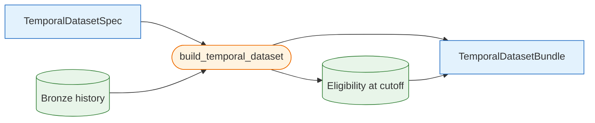
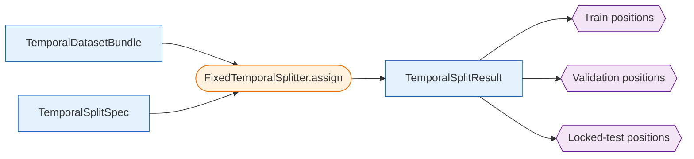
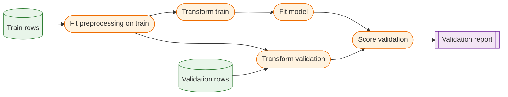

# Modeling Workflows

A workflow is an ordered composition of public operations and runtime artifacts that accomplishes a user-facing task. Specifications configure workflows, functions transform artifacts, and manifests record the resulting identity and diagnostics. The diagrams on this page describe operation order and leakage boundaries; the [Modeling Object Model](../reference/modeling-object-model.md) separately describes Python object relationships.

## End-to-End Lifecycle

Solid nodes are implemented. Dashed nodes describe planned model-development and production workflows.

```mermaid
%%{init: {"themeVariables": {"fontSize": "18px"}, "flowchart": {"nodeSpacing": 34, "rankSpacing": 52}}}%%
flowchart LR
    ingest([Ingest and update bronze data])
    eligibility([Evaluate ticker eligibility])
    construct([Construct temporal dataset])
    split([Assign purged temporal splits])
    train([Preprocess and fit model])
    validate([Evaluate validation results])
    test([Evaluate locked test once])
    register([Register selected model])
    infer([Run production inference])
    rank([Rank trade candidates])

    ingest --> eligibility --> construct --> split
    split -.-> train -.-> validate -.-> test -.-> register -.-> infer -.-> rank

    classDef implemented fill:#fff3e0,stroke:#ef6c00
    classDef planned fill:#fafafa,stroke:#9e9e9e,color:#616161,stroke-dasharray:6 4
    class ingest,eligibility,construct,split implemented
    class train,validate,test,register,infer,rank planned
```

## Temporal Dataset Construction

**Status:** Implemented.

This workflow produces one canonical, unsplit `TemporalDatasetBundle`. It deliberately computes features and targets before any split is assigned so expanding and path-dependent calculations see the complete legitimate historical prefix through the dataset cutoff.

See [Temporal Datasets](temporal-datasets.md) for the complete contract.

## Fixed Temporal Splitting

**Status:** Implemented.

This workflow assigns shared train, validation, and locked-test ranges to the canonical bundle. It first purges rows whose actual target-resolution dates cross a split end, then optionally embargoes additional observed signal dates from the end of train and validation.

See [Temporal Splitting](temporal-splitting.md) for containment, purge, and embargo semantics.

## Model Training and Validation (Planned)

**Status:** Planned.

This workflow will own every transformation whose fitted state depends on the training sample. Imputation, feature selection, scaling, sampling, and model-specific dtype conversion must be fitted on training rows only and then applied unchanged to validation rows. The locked test remains inaccessible during model and threshold selection.

## Locked-Test Evaluation (Planned)

**Status:** Planned.

After model configuration, preprocessing, and decision rules have been selected using train and validation data, the final workflow will apply the frozen pipeline to the locked test exactly once for an unbiased final estimate. Any subsequent change creates a new experiment rather than reusing the same locked result for further tuning.

## Production Inference and Ranking (Planned)

**Status:** Planned.

Production inference will evaluate inference readiness, load the required recent bronze history, reproduce the selected feature contract, apply the registered preprocessing and model artifacts, and persist candidate scores for ranking. It will not generate research targets or refit preprocessing.
