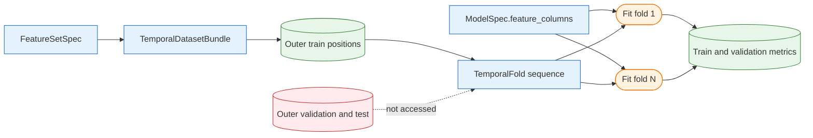
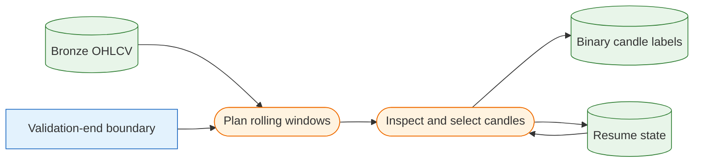
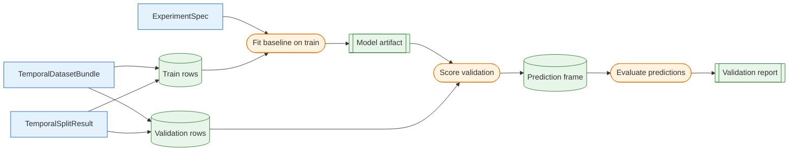

# Modeling Workflows

A workflow is an ordered composition of public operations and runtime artifacts that accomplishes a user-facing task. Specifications configure workflows, functions transform artifacts, and manifests record the resulting identity and diagnostics. The diagrams on this page describe operation order and leakage boundaries; the [Modeling Object Model](../reference/modeling-object-model.md) separately describes Python object relationships.

## End-to-End Lifecycle

Solid nodes are implemented. Dashed nodes describe planned reusable nonlinear-training and production workflows. The notebook-led XGBoost studies are documented separately below. The lifecycle diagram follows the objective-target path; the separate human-labeling path is documented below.

```mermaid
%%{init: {"themeVariables": {"fontSize": "18px"}, "flowchart": {"nodeSpacing": 34, "rankSpacing": 52}}}%%
flowchart LR
    ingest([Ingest and update bronze data])
    eligibility([Evaluate ticker eligibility])
    construct([Construct temporal dataset])
    split([Assign purged temporal splits])
    cross_validate([Compare train-only temporal folds])
    train([Fit baseline model])
    validate([Evaluate validation results])
    test([Evaluate locked test explicitly])
    advanced([Reusable nonlinear training])
    register([Register selected model])
    infer([Run production inference])
    rank([Rank trade candidates])

    ingest --> eligibility --> construct --> split --> cross_validate --> train --> validate --> test
    validate -.-> advanced -.-> register -.-> infer -.-> rank

    classDef implemented fill:#fff3e0,stroke:#ef6c00
    classDef planned fill:#fafafa,stroke:#9e9e9e,color:#616161,stroke-dasharray:6 4
    class ingest,eligibility,construct,split,cross_validate,train,validate,test implemented
    class advanced,register,infer,rank planned
```

## Temporal Dataset Construction

**Status:** Implemented.

This workflow produces one canonical, unsplit `TemporalDatasetBundle`. It deliberately computes features and targets over the complete configured dataset window before any split is assigned, so expanding and path-dependent calculations see the full window. `data_start` may precede the first training date to provide feature warm-up history.

See [Temporal Datasets](temporal-datasets.md) for the complete contract.

## Fixed Temporal Splitting

**Status:** Implemented.

This workflow assigns shared train, validation, and locked-test ranges to the canonical bundle. It first purges rows whose actual target-resolution dates cross a split end, then optionally embargoes additional observed signal dates from the end of train and validation.

See [Temporal Splitting](temporal-splitting.md) for containment, purge, and embargo semantics.

## Model Feature Selection and Train-Only Cross-Validation

**Status:** Implemented for manually configured logistic-regression candidates.

The generated feature contract remains unchanged. `ModelSpec.feature_columns` resolves one exact ordered estimator schema, while `run_baseline_cross_validation()` builds expanding global-date folds from outer train only. A fresh preprocessor and estimator are fitted independently for every fold.

Candidate ranking and winner selection remain manual. After choosing a schema, pass that `ModelSpec` to the existing outer baseline harness. See [Model Feature Selection and Train-Only Cross-Validation](feature-selection-and-cross-validation.md).

## Exploratory Cross-Sectional XGBoost Studies

**Status:** Implemented as reusable exploration notebooks.

`10_cross_sectional_xgboost_ranking.ipynb` fits regression, top-quintile classification, and learning-to-rank candidates on outer train and compares their validation rankings. One provider/date cross-section is one ranking query. The notebook keeps model parameters and plots visible for quick studies, while two small helpers standardize query preparation and common ranking diagnostics. It does not read the locked test or extend the reusable baseline harness.

`11_cross_sectional_xgboost_ranker_tuning.ipynb` loads one broad feature set once, slices curated model schemas from the resulting frame, and compares those schemas with a small deterministic XGBRanker parameter search on expanding folds inside outer train. It scores the highest-ranked stocks using future cross-sectional percentile and market-relative return, then evaluates one chosen trial on outer validation. The locked test remains untouched.

See [Cross-Sectional XGBoost Ranking Study](cross-sectional-ranking-study.md).

## Interactive Entry Labeling

**Status:** Implemented.

This workflow steps through deterministic rolling windows of train and validation history. The planned window defines which candles are saved as positive or negative; Plotly zooming and panning only change the temporary viewport. Saving upserts one authoritative binary label per provider, ticker, and trading date, while session progress is updated in the same transaction.

The chart adds EMA, retrospective pivot, volume, hover-based ATR stop/target, and commission-aware forward-outcome context. Locked-test rows remain outside the labeling boundary. See [Interactive Entry Labeling](data-labeling.md).

## Baseline Training and Validation

**Status:** Implemented.

`run_baseline_experiment()` owns train-dependent preprocessing, model fitting, scoring, evaluation, and optional artifact logging for the initial baselines. Median imputation and scaling for logistic regression are fitted on training rows only and then applied unchanged. Explicit feature schemas are retained by every baseline; constant-prior and random-ranking models otherwise preserve their previous all-column behavior and retain their fitted prevalence or seed.

The standardized report combines pooled classification and calibration results with daily cross-sectional quantiles, top-`k`, Spearman correlation, date-matched random comparisons, missingness context, and generated tables and plots. See [Baseline Models and Evaluation Harness](baseline-models.md) and [Model Evaluation](evaluation.md).

## Locked-Test Evaluation

**Status:** Implemented with explicit opt-in.

Routine calls evaluate validation only. After model configuration, preprocessing, hyperparameters, threshold, and ranking rule have been selected using train and validation, set `include_locked_test=True` to apply the same frozen model to the locked test. The validation result is unchanged by including test evaluation, and the harness does not refit between splits.

Any subsequent decision change creates a new experiment rather than reusing the inspected locked result for further tuning.

## Production Inference and Ranking (Planned)

**Status:** Planned.

Production inference will evaluate inference readiness, load the required recent bronze history, reproduce the selected feature contract, apply registered preprocessing and model artifacts, and persist candidate scores for ranking. It will not generate research targets or refit preprocessing.

## Executable Backtesting Pilot

**Status:** Implemented as a deliberately small proof of concept.

`run_backtest()` consumes raw daily OHLC prices plus point-in-time `score` and
raw-price `atr` signals. It ranks candidates after each close, plans risk-sized
orders, enters at the next open, applies fixed ATR stops and take-profit levels,
executes timeout exits at the next open, and records transactions and daily
equity. It remains separate from research-target evaluation and does not reuse
adjusted-close prices as simulated execution prices.

The pilot intentionally returns pandas tables and keeps its mechanics in one
module rather than introducing a general strategy, broker, order, or portfolio
object model. See [Backtesting Pilot](backtesting.md) for the exact procedure and
current limitations.
