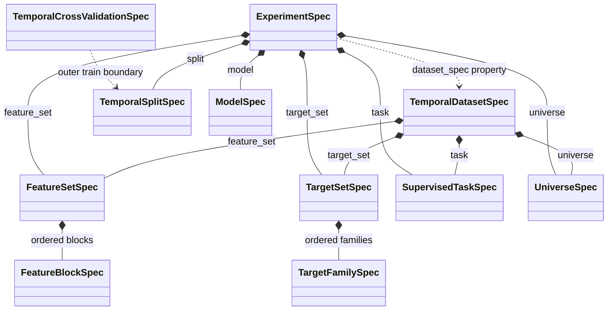
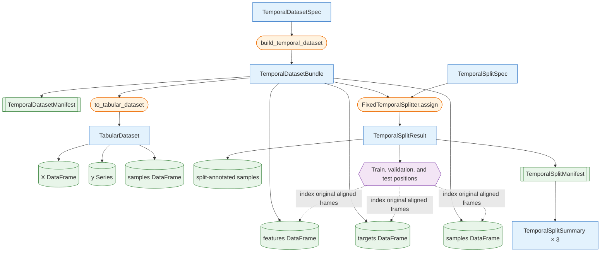
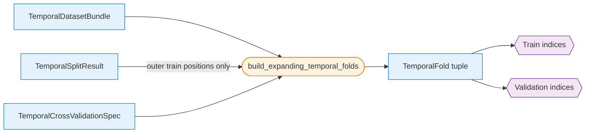
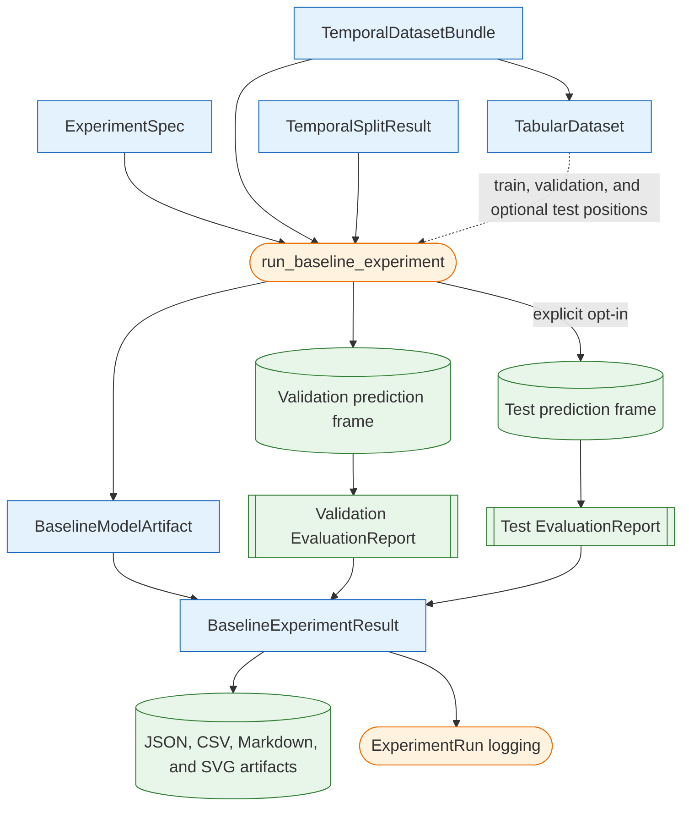

# Modeling Object Model

This page is the canonical reference for relationships between modeling specifications and runtime artifacts. Workflow order is documented separately under [Modeling Workflows](../modeling/workflows.md).

Rectangles represent contracts or runtime containers, cylinders represent row-aligned tabular data, double-bordered boxes represent manifests or reports, and rounded boxes represent operations. A dashed edge denotes a derived or non-owning relationship rather than a stored field.

## Specification Object Model

`ExperimentSpec` stores the complete static experiment configuration. Its `dataset_spec` property constructs a `TemporalDatasetSpec` from the five dataset-defining fields; `TemporalDatasetSpec` is not a separately stored field on the experiment.

Feature and target block/set specifications are executable: their recorded parameters drive builders, while declared inputs, outputs, and index preservation are enforced in declaration order. Every specification is versioned or composed from versioned contracts and can be serialized into deterministic manifest data. The experiment digest covers static choices; runtime provenance such as the Git revision belongs to the tracking layer.

## Runtime Artifact Object Model

Dataset construction produces an aligned bundle. Temporal splitting does not copy feature or target data into separate split objects; it annotates sample metadata and returns positional indices into the original bundle.

`TemporalDatasetBundle` and `TemporalSplitResult` are frozen dataclass containers that take deep copies of their pandas frames during construction. Freezing prevents field reassignment but does not make the contained DataFrames deeply immutable.

## Train-Only Cross-Validation Artifacts

`build_expanding_temporal_folds()` returns compact `TemporalFold` objects containing positional indices and inclusive candidate partition boundaries used for target-end containment. Because purging can remove rows at a partition end, the stored end dates need not be retained signal dates. The indices always reference the original aligned bundle and are subsets of outer train.

## Baseline Runtime Artifacts

`run_baseline_experiment()` combines the experiment specification, canonical bundle, and split result without copying split-specific datasets into new long-lived containers. It fits one baseline artifact on train positions and creates an independent standardized prediction frame and `EvaluationReport` for each requested evaluation split. Validation is always requested; test is optional.

The prediction frame has the stable ordered columns `split`, `target`, `score`, `predicted_class`, and `ranking_return`. `EvaluationReport` retains the exact `EvaluationConfig`, the original ranking-return source column when supplied, pooled metrics, dataset context, source predictions, per-date metrics, calibration buckets, daily and aggregate score-quantile tables, top-`k` and random selections, and feature missingness.

`BaselineModelArtifact` is a structural interface rather than a persistence framework. Each concrete baseline exposes `predict_scores()` and a JSON-compatible `to_manifest()`. The logistic artifact retains its train-fitted scikit-learn median-imputation values, post-imputation means, and scales so validation and test transformations do not depend on either evaluation split.
